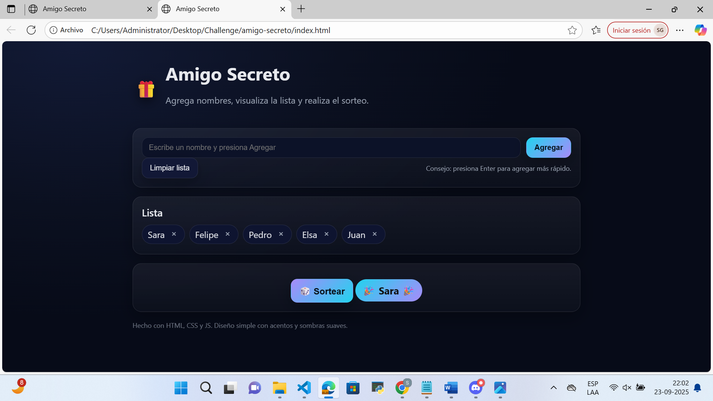

# Amigo Secreto 
Interfaz con **tarjetas, gradientes y chips** removibles.

## Funciones
- Agregar nombres con Enter o con el botón.
- Lista en “chips” con botón × para quitar.
- Sortear un nombre y mostrarlo con un estilo destacado.
- Botón “Limpiar lista”.

## Estructura
```
amigo-secreto/
├─ index.html
├─ style.css
├─ app.js
└─ assets/
   └─ preview.png
```
